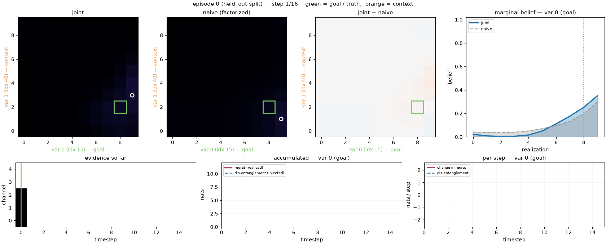
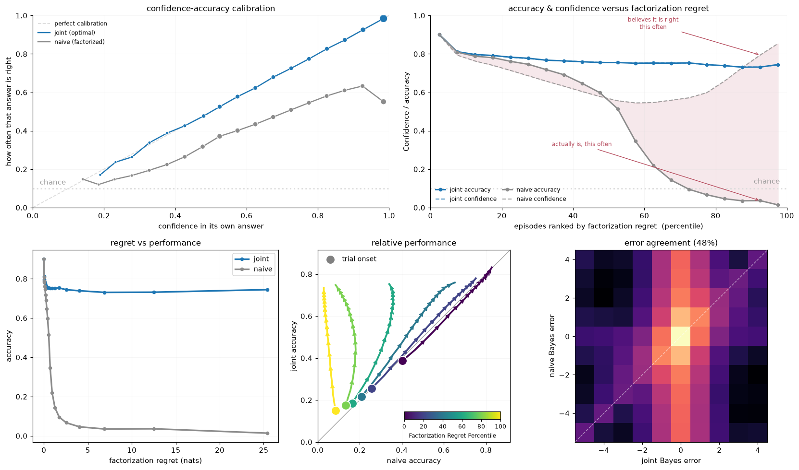
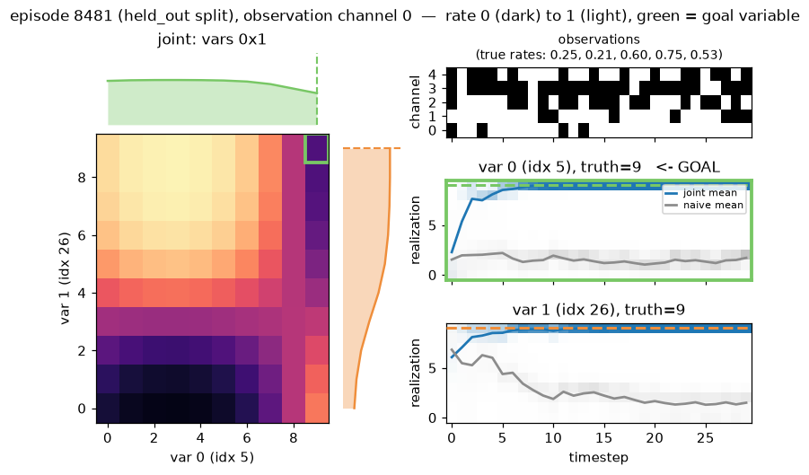

# coggrid

[](https://github.com/johnschwarcz/coggrid/actions/workflows/ci.yml)
[](https://www.python.org/downloads/)
[](LICENSE)
[](https://arxiv.org/abs/2603.27134)

A stationary POMDP for studying **compositional generalization in latent space** —
the environment and ideal-observer baselines from
[arXiv:2603.27134](https://arxiv.org/abs/2603.27134), packaged to drop into your
own training loop.

> **The navigation is in abstract space.**

Latent variables interact *pairwise* to produce observation statistics, so the
observation distribution does not factorize over them. An agent that represents
the latent space as independent factors is therefore provably lossy.

<p align="center">
  
</p>

<p align="center"><em>
One episode, as evidence accumulates. Top: the optimal observer's posterior, the
posterior a factorized observer stands behind, and where they disagree. Bottom:
the evidence stream.
</em></p>

---

## Quickstart

```python
from coggrid import CogGridConfig, World, run_observers

world = World(CogGridConfig(n_vars=500, n_contexts=2, seed=0))
batch = world.sample_episodes(2000)
traces = run_observers(batch)

traces["joint"].final()   # {'accuracy': ..., 'p_correct': ..., 'mse': ...}
traces["naive"].final()   # the same three, for the factorized observer
```

The joint observer lands **far ahead** — on the default config it is close to
twice as likely to identify the goal variable correctly. That gap is the cost of
a factorized representation, and it is the only thing separating the two: they
see identical evidence and differ solely in whether they model the interaction.

## Install

Not yet on PyPI. Install from source:

```bash
git clone https://github.com/johnschwarcz/coggrid
cd coggrid
pip install -e ".[viz]"     # numpy + gymnasium + matplotlib
```

Python 3.10+. No compiled extensions, no GPU, any OS. For development:

```bash
pip install -e ".[dev]"
pytest
```

---

## The headline result

<p align="center">
  
</p>

**Factorization regret** — `D_KL(B_joint ‖ B_naive)` over the goal variable
([§3.1](https://arxiv.org/abs/2603.27134)) — measures how far factorizing has
pushed the belief from optimal.

The middle panel is the point. Binned by regret, the joint observer's accuracy is
essentially flat while the naive observer's collapses. Regret is **not** a
measure of how hard an episode is — a hard episode would hurt both. It is
specifically a measure of 'naunce': how much *factorizing* costs on that episode. The
correlation behind each curve is printed in the panel's legend.

```python
from coggrid import factorization_regret, disentanglement

factorization_regret(traces["joint"], traces["naive"])   # (n_episodes, n_steps)
disentanglement(traces["joint"], traces["naive"], batch) # (n_episodes, n_steps)
```

**Dis-entanglement** ([§B.3](https://arxiv.org/abs/2603.27134)) is the companion
measure: the Jeffreys divergence between the naive marginal likelihood
`p(o_t | r)` and the history-conditioned one `p(o_t | r, o_1:t-1)`. It is zero
exactly when the marginal belief dynamics are Markovian, so it captures how much
of a step's update depends on what came before.

---

## How the environment works

Each episode:

1. **Contexts.** `n_contexts` latent variables are drawn from a pool of `n_vars`.
   One is designated the **goal**.
2. **Realizations.** Each active variable takes one of `n_realizations` discrete
   values. The goal variable's value is what must be inferred.
3. **Likelihood.** Every *pair* of active variables contributes an interaction
   potential built from their key/query embeddings. The potentials are summed and
   squashed, giving a Bernoulli rate per observation channel — one rate for each
   hypothetical joint realization.
4. **Observations.** The agent sees `n_steps` i.i.d. samples from those rates.

Stationary means the rate never changes within an episode. The difficulty is not
tracking a moving target; it is that the mapping from realizations to rates is
non-separable, so evidence about one variable is only interpretable given the
others.

<p align="center">
  
</p>

Left: the rate surface for one observation channel over both active variables,
with the *factorized* rate drawn as a profile along the top and right edges. The
surface is visibly not the outer product of its own marginals — that mismatch is
the entire task. Right: the evidence, and both observers converging (or not) on
the truth.

### The two baselines

| Observer | Uses | Meaning |
| --- | --- | --- |
| `joint` | `batch.rates` — the full interaction table | Bayes-optimal. The ceiling. |
| `naive` | `batch.marginal_rates` — interactions averaged away | Exactly the joint observer with the interactions removed, and nothing else changed. |

Both run in log space with a cumulative sum rather than a per-step
multiply-and-renormalize, so neither underflows at long horizons (tested to
`n_steps=4000`).

### Train / held-out splits

```python
world.sample_episodes(1000, split="train")      # <=1 novel variable, goal always familiar
world.sample_episodes(1000, split="held_out")   # every active variable novel
```

`"train"` is a condition where a subset of the variables are never the goal and never co-occur. `"held_out"` is the
a condition where no variables in the episode have been a goal, nor co-occured, during training.

---

## Gymnasium interface

```python
from coggrid import CogGridEnv

env = CogGridEnv(seed=0)
obs, info = env.reset()

for _ in range(env.cfg.n_steps):
    obs, reward, terminated, truncated, info = env.step(my_agent(obs))
```

**Observation** — a dict:

| Key | Shape | Meaning |
| --- | --- | --- |
| `observation` | `(n_observations,)` int8 | Fresh binary sample each step. |
| `active_vars` | `(n_contexts,)` int64 | Which latent variables are active. Constant within an episode. |
| `goal_context` | scalar int | Which column of `active_vars` you are scored on. |

`active_vars` holds *indices*, not embeddings — learning an embedding per index
from experience is the point of the task. At test time those indices have never
been seen.

**Action** — `Discrete(n_realizations)`: your current guess at the goal
variable's value. Actions do not affect the observation stream; the agent is a
decoder, not a controller. Guessing every step is what makes the
accuracy-versus-time curves well defined.

**Reward** — 1.0 for a correct guess, every step (`reward_mode="dense"`) or only
on the last step (`reward_mode="terminal"`).

Episodes end with `terminated=True`, not `truncated=True`: the horizon *is* the
task ("decode from exactly `n_steps` samples"), not an externally imposed limit,
so there is no value left to bootstrap.

```python
from coggrid import CogGridVectorEnv
venv = CogGridVectorEnv(n_envs=256, seed=0)
```

The vector env matches how the environment is actually cheap to run — the joint
likelihood is one vectorized einsum over the batch. `coggrid.env.register()` adds
`CogGrid-v0` to the Gymnasium registry.

---

## Visualization

Every plotting function takes data, returns a `Figure`, and never calls `show()`.

```python
from coggrid.viz import summary_figure

figures = summary_figure(batch, traces)   # -> 4 figures, narrowing in scope
```

- **`plot_episode`** — one episode's rate surface beside its belief traces (shown
  above).
- **`plot_performance`** — batch-averaged curves, one column per metric
  (accuracy, `p_correct`, MSE, factorization regret), with individual episode
  trajectories behind each mean.
- **`plot_regret_analysis`** — whether regret explains the gap (shown above).
- **`plot_belief_shape`** — the posteriors behind the accuracy numbers: the mean
  final belief with every episode aligned on its true value, and the
  distribution of `P(true value)` across episodes at each timestep.

The last two are omitted when `n_contexts == 1`, where the two observers coincide
and there is nothing to factorize away.

Every panel is also available on its own — `plot_likelihood`, `plot_trial`,
`plot_regret`, `plot_relative_accuracy`, `plot_regret_vs_accuracy`,
`plot_map_agreement`, `plot_belief_profile`, `plot_confidence_density` — and each
takes `ax` (or `axes`, or a `subplot_spec`) so you can compose your own layout.

### Watching an episode

`animate_episode` is the `render()` of this package. In a notebook, make it the
last expression in a cell and it plays — no ffmpeg, no `to_jshtml`, no backend to
configure:

```python
from coggrid.viz import animate_episode

animate_episode(batch, traces)                            # plays inline
animate_episode(batch, traces).save("figures/episode")    # or write a GIF
animate_episode(batch, traces).to_html()                  # or a scrub player
```

Panels are laid out in rows — realization grids on top, anything that evolves
over time underneath:

| Row | Panels |
| --- | --- |
| `GRID_PANELS` | `joint`, `naive (factorized)`, and `joint − naive` — where factorizing moves probability mass. Each marks the truth in green and the observer's current mode with a white ring, and the axes name which variable is the **goal** (green) and which is **context** (orange). |
| `TRACE_PANELS` | the evidence stream, revealed up to the current step |

`animate_episode(batch, traces, extended=True)` — used for the animation at the
top of this page — adds the goal variable's marginal belief and two panels
relating factorization regret to dis-entanglement, one accumulating and one per
step.

**Adding your own panel.** A panel draws its furniture into an axis and returns
an updater called with the timestep, so extending the animation never means
editing the library:

```python
from coggrid.viz import GRID_PANELS, TRACE_PANELS, animate_episode

def p_correct_panel(ax, view):
    (line,) = ax.plot([], [])
    p_correct = view.traces["joint"].p_correct[view.episode]
    ax.set(xlim=(0, view.n_steps - 1), ylim=(0, 1), title="P(true value)")

    def update(t):
        line.set_data(range(t + 1), p_correct[: t + 1])

    return update

animate_episode(batch, traces, panels=[GRID_PANELS, [*TRACE_PANELS, p_correct_panel]])
```

`view` is an `EpisodeView` — the batch, traces, episode index and palette, plus
the derived arrays panels keep needing (`joint_grid`, `naive_grid`,
`observations`, `truth`, `goal_regret`, `disentanglement`).

```bash
python examples/04_figures.py --out figures/     # the four static figures
python examples/05_animation.py --out figures/   # an episode played back, as a GIF
```

---

## Customizing the generative model

Five stages are swappable. Pass a function to `World`; you never edit the
library.

```python
def codebook_embeddings(cfg, rng):
    """An EmbeddingSource: (cfg, rng) -> (keys, queries)."""
    ...

world = World(cfg, embeddings=codebook_embeddings)
```

| Argument | Signature | Replace it to change |
| --- | --- | --- |
| `embeddings` | `EmbeddingSource` | How latent variables relate to each other |
| `contexts` | `ContextSampler` | Which variables are active; the split structure |
| `likelihood` | `LikelihoodModel` | The *form* of the interaction (e.g. add a 3-way term) |
| `realizations` | `RealizationSampler` | The prior over latent values |
| `observations` | `ObservationModel` | Non-stationary, correlated or continuous observations |

Signatures are at the top of [`src/coggrid/world.py`](src/coggrid/world.py).
Because each returns its outputs rather than mutating shared state, a replacement
can be unit-tested on its own.

---

## Memory

The joint likelihood is `n_episodes x n_observations x n_realizations ** n_contexts`.
That last term grows fast, so check before you run:

```python
>>> print(CogGridConfig(n_contexts=4, n_realizations=20).memory_report(1000))
1000 episodes x 5 channels x 20^4 realizations
  joint likelihood : 6.0 GiB
  joint belief     : 35.8 GiB
  peak (approx)    : 41.7 GiB
```

A `ResourceWarning` fires automatically above 2 GiB.

---

## Layout

```
src/coggrid/
├── config.py       CogGridConfig — every tunable, validated, immutable
├── generative.py   the generative model as pure functions
├── world.py        World (config + embeddings), EpisodeBatch, and the five
│                   swappable generative-stage signatures
├── observers.py    ideal-observer baselines, factorization regret,
│                   dis-entanglement
├── env.py          Gymnasium single and vector environments
└── viz/            plotting and animation
examples/           five runnable scripts
docs/make_assets.py regenerates the images in this README
tests/              behavioral tests, plus the docstring examples
```

Numerical notes worth knowing:

- **Randomness** is an explicit `numpy.random.Generator` throughout — no global
  `np.random` — so any batch is reproducible from a seed.
- **Inference** accumulates log-likelihoods with a cumulative sum rather than
  multiplying and renormalizing per step, so it does not underflow at long
  horizons.
- **Per-step belief updates** are recovered by differencing *log* beliefs.
  Beliefs routinely fall below `1e-12` once an observer is confident, and
  dividing two such numbers loses most of the significant digits.
- **Rates** are clipped away from 0 and 1 before taking logs, and the sigmoid is
  overflow-safe.

---

## Related repositories

| Repository | Contents |
| --- | --- |
| **this one** (`coggrid`) | The environment and ideal-observer baselines. No networks, no torch. |
| [`CognitiveGridworld`](https://github.com/johnschwarcz/CognitiveGridworld) | The reference implementation from the paper: environment *and* trained networks, together, as published. |

Use **this** repo if you want the task. Use the paper repo to reproduce published
results.

---

## Citation

```bibtex
@article{schwarcz2026factorization,
  title  = {Factorization Regret mediates compositional generalization in latent space},
  author = {Schwarcz, John},
  year   = {2026},
  eprint = {2603.27134},
  archivePrefix = {arXiv}
}
```

## License

MIT — see [LICENSE](LICENSE).
