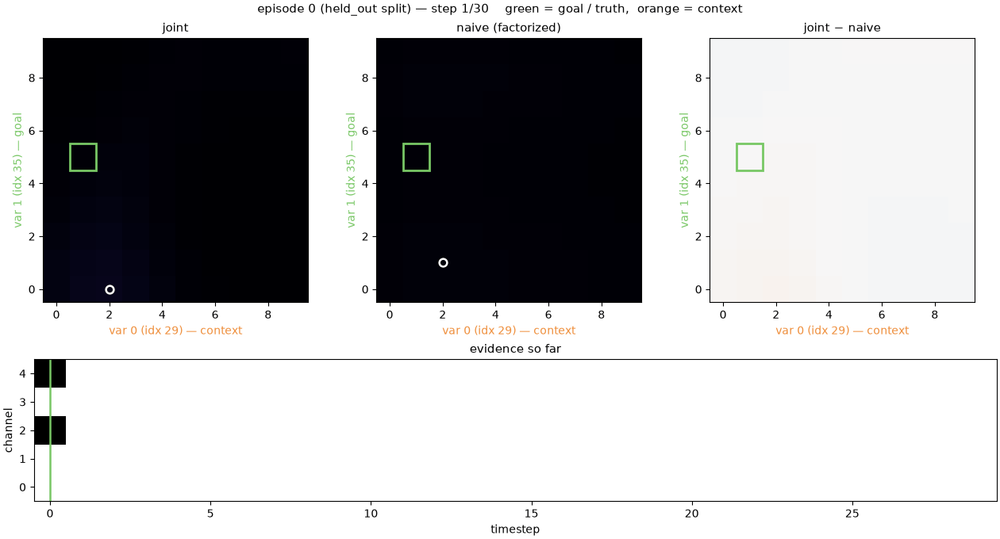
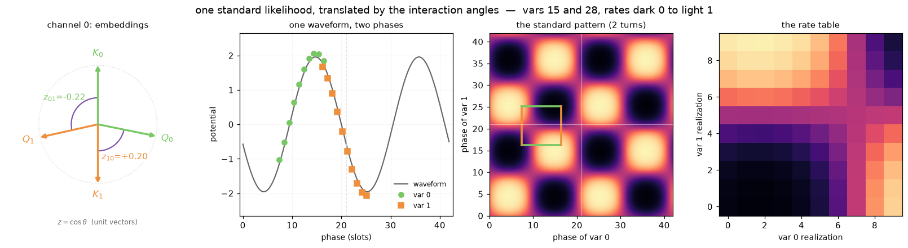
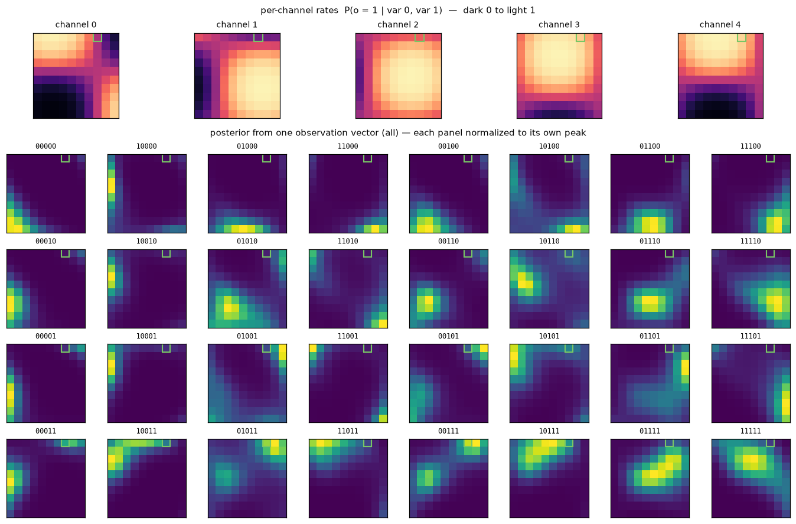

# coggrid

[](https://github.com/johnschwarcz/coggrid/actions/workflows/ci.yml)
[](https://www.python.org/downloads/)
[](LICENSE)
[](https://arxiv.org/abs/2603.27134)

A stationary POMDP for studying **compositional generalization in latent space** —
the environment and ideal-observer baselines from
[arXiv:2603.27134](https://arxiv.org/abs/2603.27134).

> **Bayesian inference is represented as navigating a latent space.**

An example episode:
<p align="center">
  
</p>

<p align="center"><em>
Top: the optimal observer's posterior, the naive observer's posterior, and where
they disagree. Bottom: A stream of observations.
</em></p>


---

## Contrasting Optimal and Naive Bayes

<p align="center">
  
</p>

**Factorization regret** — `D_KL(B_joint ‖ B_naive)` 
([§3.1](https://arxiv.org/abs/2603.27134)) — measures the cost of factorizing inference of interacting latent variables.

```python
from coggrid import CogGridConfig, World, run_observers
from coggrid import factorization_regret, disentanglement

world = World(CogGridConfig(n_vars=500, n_contexts=2, seed=0))
batch = world.sample_episodes(2000)
traces = run_observers(batch)

factorization_regret(traces["joint"], traces["naive"])   # (n_episodes, n_steps)
disentanglement(traces["joint"], traces["naive"], batch) # (n_episodes, n_steps)
```

**Dis-entanglement** ([§B.3](https://arxiv.org/abs/2603.27134)) quantifies the 'history-dependence' of an observation, 
by measuring the divergence between the naive marginal belief update `p(o_t | r)` 
and the optimal marginal belief update `p(o_t | r, o_1:t-1)`. 
It is zero when marginal belief dynamics are Markovian.

---

## How the environment works

Each episode:

1. **Contexts.** `n_contexts` latent variables are drawn from a pool of `n_vars`.
   One is designated the **goal**.
2. **Realizations.** Each "active" variable in the context takes one of `n_realizations` discrete
   values.
3. **Likelihood.** Active variables interact through key/query embeddings which map to an `n_realizations`^`n_contexts` likelihood.
5. **Observations.** `n_steps` i.i.d. observations sampled stochastically from the likelihood / prob. of observing 1 aka 1 - prob. of observing 0.

### Interactions shift the joint likelihood in latent space

The inner product of one variable's key with the other's query sets a *phase* that translates an "XOR"-like pattern.

<p align="center">
  
</p>

```python
from coggrid.viz import plot_interaction_phases

plot_interaction_phases(world, batch, episode=0, channels=(0, 1))
```
Reading left to right:
1. **Embeddings.** Each latent variable carries a **key** and a **query** vector
   per channel. The angle between one variable's key and the other's query gives a score `z`. 
2. **Phase.**  Each score shifts a standard sinusoid by `−2π · likelihood_freq · z`. 
3. **The standard pattern**, Sinasoids are expanded to a repeating pattern through an outer product.
4. **The selected pattern**  A specific pair of scores defines a specific region of the pattern.

### What a single observation actually says

The agent sees a **vector** of
`n_observations`  at once, and its likelihood is the product of the
per-channel rates.

<p align="center">
  
</p>

```python
from coggrid.viz import plot_evidence_likelihood

plot_evidence_likelihood(batch, episode=0)
```

The top row is the per-channel joint likelihoods.
The grid below is every possible observation vector and the belief update it induces.


## Quickstart

```python
from coggrid import CogGridConfig, World, run_observers

world = World(CogGridConfig(n_vars=500, n_contexts=2, seed=0))
batch = world.sample_episodes(2000)
traces = run_observers(batch)

traces["joint"].final()   # {'accuracy': ..., 'p_correct': ..., 'mse': ...}
traces["naive"].final()   # the same three, for the factorized observer
```

The joint observer is more likely to identify the goal variable correctly. 
When the naive observer disagrees with the joint observer, it is likely to be wrong. 
The naive observer is not just noisier, but can become misaligned.

## Install

Not yet on PyPI. Install from source:

```bash
git clone https://github.com/johnschwarcz/coggrid
cd coggrid
pip install -e ".[viz]"     # numpy + gymnasium + matplotlib
```

Python 3.10+. No compiled extensions, no GPU, any OS. For development:

```bash
pip install -e ".[dev]"
pytest
```

### Every knob

`CogGridConfig` holds the whole specification of a world. 

| Field | Default | Meaning |
| --- | --- | --- |
| `n_vars` | 500 | Size of the latent-variable pool episodes draw from. |
| `n_contexts` | 2 | Variables active per episode. The joint table is `n_realizations ** n_contexts` wide, so this drives memory. |
| `n_realizations` | 10 | Discrete values each active variable can take. |
| `n_observations` | 5 | Binary observation channels. |
| `n_steps` | 30 | Observation samples per episode — the horizon. |
| `embedding_dim` | 30 | Length of each key/query vector. Must be ≥ `n_observations`, since they are orthogonalized across channels. |
| `likelihood_temp` | 2.0 | Scales the potentials before the sigmoid. Higher pushes rates towards 0/1, making single observations more informative. |
| `likelihood_freq` | 1.0 | Periods in the value profile. Higher partitions the realization axis more finely. |
| `n_episodes` | 1000 | Default batch size for `sample_episodes`. |
| `n_held_out_vars` | `None` | Size of the held-out pool. `None` means `n_vars // 10`. Held-out variables are `range(n_held_out_vars)`. |
| `subsample_vars` | `None` | If set, draw contexts from a random subset of this size within each split. |
| `allow_repeated_vars` | `True` | Whether one episode may activate the same variable twice. |
| `seed` | `None` | Seed for the default RNG. `None` means a fresh world each run. |

### The two baselines

| Observer | Uses | Meaning |
| --- | --- | --- |
| `joint` | `batch.rates` — the full interaction table | Bayes-optimal. The ceiling. |
| `naive` | `batch.marginal_rates` — interactions averaged away | Exactly the joint observer with the interactions removed, and nothing else changed. |

Both run in log space with a cumulative sum rather than a per-step
multiply-and-renormalize, so neither underflows at long horizons (tested to
`n_steps=4000`).

### Train / held-out splits

```python
world.sample_episodes(1000, split="train")      # <=1 novel variable, goal always familiar
world.sample_episodes(1000, split="held_out")   # every active variable novel
```

`"train"` is the condition under which a subset of the variables are never the
goal and never co-occur. `"held_out"` is the condition where no variable in the
episode has been a goal, nor co-occurred, during training. This is specifically relevant for training and evaluating networks.

---

## Gymnasium interface

```python
from coggrid import CogGridEnv

env = CogGridEnv(seed=0)
obs, info = env.reset()

for _ in range(env.cfg.n_steps):
    obs, reward, terminated, truncated, info = env.step(my_agent(obs))
```

**Observation** — a dict:

| Key | Shape | Meaning |
| --- | --- | --- |
| `observation` | `(n_observations,)` int8 | Fresh binary sample each step. |
| `active_vars` | `(n_contexts,)` int64 | Which latent variables are active. Constant within an episode. |
| `goal_context` | scalar int | Which column of `active_vars` you are scored on. |

`active_vars` holds *indices*, not embeddings — learning an embedding per index
from experience is the point of the task. At test time those indices have never
been seen.

**Action** — `Discrete(n_realizations)`: the agent's current guess (MAP) of the goal
variable's value.

**Reward** — 1.0 for a correct guess, every step (`reward_mode="dense"`) or only
on the last step (`reward_mode="terminal"`).

Episodes end with `terminated=True`, not `truncated=True`.

`coggrid.env.register()` adds `CogGrid-v0` to the Gymnasium registry.

`CogGridEnv` takes:

| Argument | Default | Meaning |
| --- | --- | --- |
| `config` | `None` | The world specification, per the table above. `None` builds a default `CogGridConfig()`. |
| `world` | `None` | Draw from an existing `World` instead of building one, so several environments share embeddings and therefore the same split. Overrides `config`. |
| `split` | `"held_out"` | Which variable pool episodes come from — see below. |
| `reward_mode` | `"dense"` | `"dense"` scores every step, `"terminal"` only the last. |
| `buffer_size` | 256 | Episodes generated per internal refill. Sampling in blocks is much cheaper than one at a time; larger uses more memory. |
| `expose_likelihood` | `False` | Put the joint and marginal rate tables in `info` — what an ideal-observer baseline needs, and what a learning agent must not see. |
| `render_mode` | `None` | `"ansi"` makes `render()` return a text summary of the current step. |
| `seed` | `None` | Seeds the world's embeddings and the episode stream. `None` means fresh episodes each run. |

### Batched rollouts

There is no vector environment. Batching is what `World` already does:

```python
rollout = world.sample_episodes(4096)      # every episode at once
rollout.observations                       # (4096, n_steps, n_observations)
```

`sample_episodes` builds the whole batch with one vectorized einsum over the
joint likelihood, which is the cheap path. A gym wrapper around it would only add
a step-by-step interface on top of data that is already complete.

---

## Visualization

Every plotting function takes data, returns a `Figure`, and never calls `show()`.

```python
from coggrid.viz import summary_figure

figures = summary_figure(batch, traces)   # -> 4 figures, narrowing in scope
```

- **`plot_episode`** — one episode's rate surface beside its belief traces (shown
  above).
- **`plot_performance`** — batch-averaged curves, one column per metric
  (accuracy, `p_correct`, MSE, factorization regret), with individual episode
  trajectories behind each mean.
- **`plot_regret_analysis`** — whether regret explains the gap (shown above).
- **`plot_belief_shape`** — the posteriors behind the accuracy numbers: the mean
  final belief with every episode aligned on its true value, and the
  distribution of `P(true value)` across episodes at each timestep.

The last two are omitted when `n_contexts == 1`, where the two observers coincide
and there is nothing to factorize away.

Every panel is also available on its own — `plot_likelihood`, `plot_trial`,
`plot_regret`, `plot_relative_accuracy`, `plot_regret_vs_accuracy`,
`plot_map_agreement`, `plot_belief_profile`, `plot_confidence_density` — and each
takes `ax` (or `axes`, or a `subplot_spec`) so you can compose your own layout.

### Watching an episode

`animate_episode` is the `render()` of this package. In a notebook, make it the
last expression in a cell and it plays — no ffmpeg, no `to_jshtml`, no backend to
configure:

```python
from coggrid.viz import animate_episode

animate_episode(batch, traces)                            # plays inline
animate_episode(batch, traces).save("figures/episode")    # or write a GIF
animate_episode(batch, traces).to_html()                  # or a scrub player
```

Panels are laid out in rows — realization grids on top, anything that evolves
over time underneath:

| Row | Panels |
| --- | --- |
| `GRID_PANELS` | `joint`, `naive (factorized)`, and `joint − naive` — where factorizing moves probability mass. Each marks the truth in green and the observer's current mode with a white ring, and the axes name which variable is the **goal** (green) and which is **context** (orange). |
| `TRACE_PANELS` | the evidence stream, revealed up to the current step |

`animate_episode` takes `episode` (which episode to play, default 0), `fps`
(playback speed, default 6), and two arguments that decide what is drawn:

- **`extended=True`** — used for the animation at the top of this page — adds the
  goal variable's marginal belief and two panels relating factorization regret to
  dis-entanglement, one accumulating and one per step.
- **`panels`** — a list of rows, each row a list of panel functions, replacing the
  default layout entirely. This is the extension point below.

**Adding your own panel.** A panel draws its furniture into an axis and returns
an updater called with the timestep, so extending the animation never means
editing the library:

```python
from coggrid.viz import GRID_PANELS, TRACE_PANELS, animate_episode

def p_correct_panel(ax, view):
    (line,) = ax.plot([], [])
    p_correct = view.traces["joint"].p_correct[view.episode]
    ax.set(xlim=(0, view.n_steps - 1), ylim=(0, 1), title="P(true value)")

    def update(t):
        line.set_data(range(t + 1), p_correct[: t + 1])

    return update

animate_episode(batch, traces, panels=[GRID_PANELS, [*TRACE_PANELS, p_correct_panel]])
```

`view` is an `EpisodeView` — the batch, traces, episode index and palette, plus
the derived arrays panels keep needing (`joint_grid`, `naive_grid`,
`observations`, `truth`, `goal_regret`, `disentanglement`).

```bash
python examples/04_figures.py --out figures/     # the four static figures
python examples/05_animation.py --out figures/   # an episode played back, as a GIF
```

---

## Customizing the generative model

Five stages are swappable. Pass a function to `World`; you never edit the
library.

```python
def codebook_embeddings(cfg, rng):
    """An EmbeddingSource: (cfg, rng) -> (keys, queries)."""
    ...

world = World(cfg, embeddings=codebook_embeddings)
```

| Argument | Signature | Replace it to change |
| --- | --- | --- |
| `embeddings` | `EmbeddingSource` | How latent variables relate to each other |
| `contexts` | `ContextSampler` | Which variables are active; the split structure |
| `likelihood` | `LikelihoodModel` | The *form* of the interaction (e.g. add a 3-way term) |
| `realizations` | `RealizationSampler` | The prior over latent values |
| `observations` | `ObservationModel` | Non-stationary, correlated or continuous observations |

Signatures are at the top of [`src/coggrid/world.py`](src/coggrid/world.py).
Because each returns its outputs rather than mutating shared state, a replacement
can be unit-tested on its own.

---

## Memory

The joint likelihood is `n_episodes x n_observations x n_realizations ** n_contexts`.
That last term grows fast, so check before you run:

```python
>>> print(CogGridConfig(n_contexts=4, n_realizations=20).memory_report(1000))
1000 episodes x 5 channels x 20^4 realizations
  joint likelihood : 6.0 GiB
  joint belief     : 35.8 GiB
  peak (approx)    : 41.7 GiB
```

A `ResourceWarning` fires automatically above 2 GiB.

---

## Layout

```
src/coggrid/
├── config.py       CogGridConfig — every tunable, validated, immutable
├── generative.py   the generative model as pure functions
├── world.py        World (config + embeddings), EpisodeBatch, and the five
│                   swappable generative-stage signatures
├── observers.py    ideal-observer baselines, factorization regret,
│                   dis-entanglement
├── env.py          Gymnasium single and vector environments
└── viz/            plotting and animation
examples/           five runnable scripts
docs/make_assets.py regenerates the images in this README
tests/              behavioral tests, plus the docstring examples
```

Numerical notes worth knowing:

- **Randomness** is an explicit `numpy.random.Generator` throughout — no global
  `np.random` — so any batch is reproducible from a seed.
- **Inference** accumulates log-likelihoods with a cumulative sum rather than
  multiplying and renormalizing per step, so it does not underflow at long
  horizons.
- **Per-step belief updates** are recovered by differencing *log* beliefs.
  Beliefs routinely fall below `1e-12` once an observer is confident, and
  dividing two such numbers loses most of the significant digits.
- **Rates** are clipped away from 0 and 1 before taking logs, and the sigmoid is
  overflow-safe.

---

## Related repositories

| Repository | Contents |
| --- | --- |
| **this one** (`coggrid`) | The environment and ideal-observer baselines. No networks, no torch. |
| [`CognitiveGridworld`](https://github.com/johnschwarcz/CognitiveGridworld) | The reference implementation from the paper: environment *and* trained networks, together, as published. |

Use **this** repo if you want the task. Use the paper repo to reproduce published
results.

---

## Citation

```bibtex
@article{schwarcz2026factorization,
  title  = {Factorization Regret mediates compositional generalization in latent space},
  author = {Schwarcz, John},
  year   = {2026},
  eprint = {2603.27134},
  archivePrefix = {arXiv}
}
```

## License

MIT — see [LICENSE](LICENSE).
